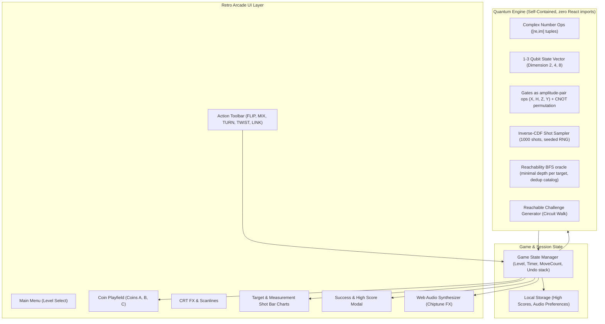
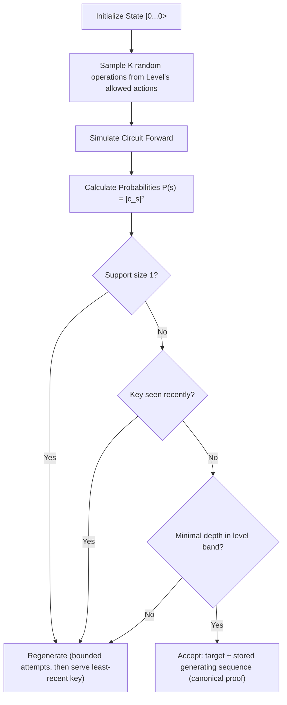

# Qubit Rush V1 — Comprehensive Plan of Action & Verification Strategy

## 1. Executive Summary & Vision

**Qubit Rush** is a retro arcade educational game designed to introduce players to quantum principles (superposition, measurement, interference, multi-qubit correlation) **through direct physical interaction rather than mathematical exposition**.

### Core Tenet: "Interaction Before Explanation"
* **Metaphor:** Quantum Coins ($H = |0\rangle$, $T = |1\rangle$).
* **Superposition:** Coins visually flicker between Heads and Tails.
* **Operations:** Everyday tactile actions (**FLIP**, **MIX**, **TURN**, **TWIST**, **LINK**), hiding technical Dirac notation and gate names.
* **Goal:** Manipulate the coin states until measuring them matches a target probability distribution.
* **Platform:** 100% browser-based (client-only, no server/database, zero installation, instant load under 30 seconds).

### Key Mathematical Consequence (drives several decisions below)
The action set {X, H, Y, Z, CNOT} is the **Clifford gate set**. Starting from $|0\ldots0\rangle$, every reachable state is a *stabilizer state*, whose computational-basis probability distribution is **uniform over an affine subspace of $\text{GF}(2)^N$**. Therefore:
* All reachable probabilities are exactly in $\{0, \tfrac18, \tfrac14, \tfrac12, 1\}$ — no tiny probabilities can ever occur.
* The complete catalog of distinct targets is tiny: **L1: 3 distributions (1 non-trivial — always the 50/50), L2: 11 (7 non-trivial), L3: 51 (43 non-trivial)**.
* Any two distinct reachable distributions differ by $\ge \tfrac18$ at some outcome — the win tolerance (§7) is provably safe.
* **Doc fix required:** the Level 3 example in `IDEA.md` (HHH/HTT/THT/TTT at 25% each) is **unreachable** — its support $\{000,011,101,111\}$ is not an affine subspace. Replace it with a reachable example (e.g. HHH/HTT/THH/TTT = $\{000,011,100,111\}$). Never hand-author targets.

---

## 2. Verification Strategy

Correctness is guaranteed by **in-repo tests** (Vitest + Playwright), not by agent prompts.

* **Source of truth = the Vitest invariant suite** (§11) checked on every change: gate algebra, bit ordering, normalization, challenge solvability, win-condition purity.
* **Agent/browser skills** (`webapp-testing`, `agent-browser`, `frontend-design`, available in the dev environment) are *development tooling* for exploratory UI verification and visual work — they complement but never replace the test suite. No `npx skills add` install step is needed.
* **Do not create project-level "verifier skills"** (e.g. `.agents/skills/quantum-simulator-verifier`). A skill is an agent prompt, not a verifiable artifact; anything that matters must live in `src/**/*.test.ts` and `e2e/*.spec.ts`.

---

## 3. System Architecture & Tech Stack



### Technology Selection (smallest sufficient set)
* **Core Framework:** React 19 + TypeScript + Vite. No router and no state library — one `useReducer` with `view: 'menu' | 'play'` is sufficient.
* **Styling & Theme:** Tailwind CSS (layout utilities only) + one custom `crt.css` (scanlines, phosphor glow, bezel) + pixel fonts `Press Start 2P` & `VT323`. **No icon library** (rounded line icons fight the pixel aesthetic — use text glyphs/CSS shapes). No animation library (CSS keyframes).
* **Audio Engine:** Pure Web Audio API synthesizers (square, sawtooth, noise waves; no external sound files). The `AudioContext` is created/resumed on the **first user gesture** (browser autoplay policy) and has a persisted mute toggle.
* **Testing:** Vitest for pure-math + game-logic tests; Playwright for end-to-end browser verification. No component-test layer (the reducer is tested pure; Playwright covers UI).
* **Storage:** `localStorage` with versioned payloads (`{v:1,...}`) wrapped in `try/catch` — degrade to in-memory scores when storage is unavailable (private mode) or corrupt.
* **RNG:** `rng.ts` with `mulberry32(seed)`; a seed from `Date.now()` at boot and a `?seed=` URL parameter for deterministic tests/E2E. All randomness (challenge generation and shot sampling) flows through it.

### Module Map (dependency direction: `ui → game → quantum`; `audio`/`storage` are leaves)
```
src/
  quantum/  complex.ts gates.ts state.ts sampler.ts rng.ts analysis.ts
  game/     types.ts challenge.ts scoring.ts reducer.ts storage.ts win.ts
  audio/    synth.ts
  ui/       App.tsx MenuScreen.tsx GameScreen.tsx components/ styles/
e2e/        playwright.config.ts + specs
```

---

## 4. Quantum Simulation Mathematical Specification

### A. State Vector & Endianness
For $N \in \{1, 2, 3\}$ coins, the state vector $|\psi\rangle$ is an array of $2^N$ complex numbers:
$$c_k = a_k + i b_k, \qquad \sum_{k=0}^{2^N-1} |c_k|^2 = 1$$

**Endianness Convention (Coin to Bit Mapping): Coin A = most significant bit of the basis index, Tails = 1, Heads = 0.**
Implemented by exactly two helpers, used everywhere (gates, labels, CNOT):

* `coinBit(N, coin) = N - 1 - coin` (Coin A → bit `N-1`)
* `label(k, N)` — bits of `k`, MSB first, mapped to `H`/`T`

| index | bits | label | | index | bits | label |
|-------|------|-------|---|-------|------|-------|
| 0 | 000 | HHH | | 4 | 100 | THH |
| 1 | 001 | HHT | | 5 | 101 | THT |
| 2 | 010 | HTH | | 6 | 110 | TTH |
| 3 | 011 | HTT | | 7 | 111 | TTT |

The 2-coin truncation gives `00=HH, 01=HT, 10=TH, 11=TT` as required. Histogram rows and target rows are always listed in index order via `label()` — a single source of truth prevents display/index divergence. The full table is locked by a unit test.

### B. Action to Quantum Gate Mappings
1. **FLIP ($X$ gate):** $\begin{pmatrix} 0 & 1 \\ 1 & 0 \end{pmatrix}$
2. **MIX ($H$ gate - Hadamard):** $\frac{1}{\sqrt{2}} \begin{pmatrix} 1 & 1 \\ 1 & -1 \end{pmatrix}$
   *Applied to $|0\rangle$ (Heads) $\implies \frac{1}{\sqrt{2}}(|0\rangle + |1\rangle)$ (50% Heads, 50% Tails).*
3. **TURN ($Z$ gate):** $\begin{pmatrix} 1 & 0 \\ 0 & -1 \end{pmatrix}$
4. **TWIST ($Y$ gate):** $\begin{pmatrix} 0 & -i \\ i & 0 \end{pmatrix}$ — introduces complex amplitudes; amplitudes must be stored as real+imag from day one (never real-only).
5. **LINK ($CNOT$ gate):** control coin $c$, target coin $t$; bit $t$ flips iff bit $c$ is 1 (Tails). All 6 ordered pairs in 3-coin systems: $(A,B), (A,C), (B,A), (B,C), (C,A), (C,B)$. **Direction matters:** on state `TH`, `LINK(A,B)` → `TT` while `LINK(B,A)` leaves `TH` unchanged.

**Implementation strategy (deliberately avoids tensor-product machinery — the classic source of endianness bugs):**
* `applyGate1(U, coin)`: apply the 2×2 matrix directly to each amplitude pair $(k,\; k \oplus 2^{\text{coinBit}})$. No `kron`, no built matrices.
* `applyCNOT(control, target)`: basis-index permutation — for each $k$ with control bit 1 and target bit 0, swap $c_k \leftrightarrow c_{k \oplus 2^{\text{targetBit}}}$. Being a permutation makes normalization automatic.
* `probabilities()`: $p_i = |c_i|^2$, clamped at 0 and renormalized defensively (guards float drift).

**Game logic compares probabilities only — never amplitudes** (global phase from $Y$/CNOT is unobservable and must never affect outcomes).

### C. Coin Flicker — Visual Heuristic
A coin's flicker is a **game metaphor, not a mathematical test for superposition**. The predicate is named `shouldFlicker(marginal)` and documented as a visual heuristic:

$$\texttt{shouldFlicker} \iff 0.02 < P(\text{coin} = T) < 0.98$$

* No game logic may branch on it (invariant I14). Nothing named `isInSuperposition` may exist in the codebase.
* In practice the rule is exact for this gate set: stabilizer-state single-coin marginals are always $\in \{0, \tfrac12, 1\}$, so a coin flickers iff its marginal is 50/50. No threshold tuning needed.
* Reduced-motion fallback: no flicker; static half-H/half-T coin glyph with a small "UNSETTLED" label.

---

## 5. Solvability & Reachable Challenge Generation

### Generation (unchanged concept — it is sound)


* **Level 1 (One Coin):** $K \in [1, 3]$ from `[FLIP, MIX]`.
* **Level 2 (Two Coins):** $K \in [2, 5]$ from `[FLIP, MIX, TURN, TWIST, LINK]`.
* **Level 3 (Three Coins):** $K \in [3, 7]$ from `[FLIP, MIX, TURN, TWIST, LINK]`.
* **Solvability guarantee:** the stored generating sequence replays to the target exactly; verified in tests. Requires the invariant *generator action set ⊆ player action set per level* (test-locked) — it holds today for all three levels.

### Rejection rules (fixed — the previous rules were too weak)
* **Trivial ⇔ support size 1** (any definite-coin outcome — not merely $|0\ldots0\rangle$).
* **Duplicate ⇔ equal canonical key:** the probability vector rounded to 6 decimals and joined — never raw float equality, never circuit comparison (different circuits may legitimately yield the same distribution; any circuit producing the distribution is a valid player solution).
* **Per-level recent-history queue** (~last 8 keys), not "previous target". Rejection is bounded (e.g. 30 attempts), falling back to the least-recently-served key so generation can never loop forever.
* **Difficulty band** by *minimal* solution depth, not generating length $K$ (which only upper-bounds it). A small BFS oracle (`analysis.ts`) over the reachable state space (≤ 1080 stabilizer states for 3 qubits; milliseconds of work) yields exact minimal depth + a minimal solution per target key. Accept targets whose minimal depth fits the level band (e.g. L2: 2–4, L3: 3–6). This is a grading/dedup oracle — **generation itself remains the random circuit walk**.

### Known target-space limits (expectation setting, not bugs)
* **L1 has exactly one non-trivial target (50/50)** — a mathematical fact of single-qubit Cliffords. UI copy must not promise variety on L1, and dedup must exempt it. Only a new non-Clifford action could change this — explicitly out of scope.
* **L2 has 7 non-trivial targets** — repeats are normal; replay value comes from cleaner/faster solutions and scores.
* All bar heights are exactly one of {0, 12.5, 25, 50, 100}% (equal-height groups only).

---

## 6. Measurement Experience & Win Verification

### Two-Tier Measurement Architecture
1. **Visual Sampling (Player Perception):**
   * Player presses `[ MEASURE ]`.
   * The simulator draws $S = 1000$ shots via **inverse-CDF cumulative sampling** (not rejection sampling) from the current $p_i = |c_i|^2$, using the injected seeded RNG.
   * Visual shot counters cascade into the histogram bars with retro audio clicks.
   * Statistical variance is desired and visible (e.g. 494 vs 506).
2. **Algorithmic Correctness (Win Condition):**
   * The player is **never judged on shot noise**. Win compares the exact underlying distributions:
     $$\max_i \left| P_{\text{current}}(i) - P_{\text{target}}(i) \right| < 0.005$$
   * Both vectors defensively normalized first. The sampler output must never reach this function (enforced by signature and test).

**Why 0.005 is provably safe:** both vectors have entries in $\{0,\tfrac18,\tfrac14,\tfrac12,1\}$ (player states are also stabilizer states), so any two *distinct* reachable distributions differ by $\ge \tfrac18 = 0.125$ at some index. The tolerance sits 25× below the smallest real difference and far above float noise: no false positives, no false negatives.

### Measurement Semantics (explicit)
* **MEASURE does not collapse or modify the state vector** (collapsing would make distribution-matching unreachable after one press). It only samples and renders.
* The "coins settle on definite results" moment is a **transient cosmetic animation** (brief flicker freeze showing sampled outcomes); afterwards the coins reflect the unchanged state again.
* The histogram shows the most recent measurement only and is **cleared whenever the state changes** (an action after measuring) so stale samples are never mistaken for current ones.
* Percentages render `p × 100` with at most one decimal (12.5% values occur at 3 coins and must display honestly).

---

## 7. Game State Semantics

* **UNDO** — exact snapshot revert (a copy of the ≤8-amplitude vector is stored per action; no inverse-gate reapplication). Pops the action, decrements the move counter, clears the histogram. The timer keeps running — time is the cost of exploration.
* **RESET** — keeps the current target; restores $|0\ldots0\rangle$; clears history, histogram, moves; zeroes the timer.
* **PLAY AGAIN** (success modal) = RESET of the same target. **NEXT CHALLENGE** = new target via the generator.
* Success locks the board (no undo after winning); success is detected only at MEASURE.
* **Timer** accumulates via `performance.now()` deltas (throttle-safe in background tabs) and renders `mm:ss`; seconds are floored for scoring.

---

## 8. Scoring & Progression Model

* **Score Formula:**
  $$\text{Score} = \max\left(100, \left(5000 - (\text{Moves} \times 120) - (\lfloor\text{Seconds}\rfloor \times 15)\right)\right) \times \text{LevelMultiplier}$$
  * Multipliers: 1 Coin = $\times 1$, 2 Coins = $\times 2$, 3 Coins = $\times 4$.
  * Deterministic pure function of (moves, elapsed, level) — displayed live during play.
  * Accuracy is not a scoring factor (winning requires exact distribution match; nothing finer is scoreable).
* **Local High Scores:**
  * Versioned JSON in `localStorage` (`qubit_rush_highscores` → `{v:1, best:{"1":n|null,"2":...,"3":...}}`), all access in `try/catch`, in-memory fallback.
  * Highest score tracked per level; "NEW HIGH SCORE!" banner on strictly beating the previous best (a first-ever score counts).
  * Settings (mute) stored separately (`qubit_rush_settings`).

---

## 9. Phased Implementation Roadmap

### Phase 1 — Quantum Engine
* **Files:** `src/quantum/{complex,gates,state,sampler,rng}.ts` + colocated tests.
* **Responsibility:** complex ops; 2×2 gates X/H/Z/Y; `applyGate1` on amplitude pairs; `applyCNOT` permutation; `probabilities()`; `coinBit`/`label`; inverse-CDF `sampleShots(probs, count, rng)`; seeded RNG.
* **Dependencies:** none.
* **Tests before moving on:** gate squares $=\mathbf{I}$; unitarity $U^\dagger U = \mathbf{I}$; norm preserved to $10^{-9}$ across random op sequences ($n=1,2,3$); the full index/label table; LINK direction asymmetry (`TH` example); Bell test (below); interference tests (`MIX→TURN→MIX` ⇒ $P(T)=1$; `MIX→FLIP→MIX` ⇒ $P(H)=1$); TURN-alone leaves probabilities unchanged; TWIST flips definite coins; Y-phase correctness; seeded sampler determinism ($\sum$counts $= 1000$, only supported outcomes).
* **Acceptance:** all invariants I1–I11 green; engine has zero React imports.

### Phase 2 — Challenge Generation + Verification
* **Files:** `src/game/{types,challenge}.ts`, `src/quantum/analysis.ts` (BFS oracle) + tests incl. `challenge.property.test.ts`.
* **Dependencies:** Phase 1.
* **Tests before moving on:** 500 generated challenges — replaying the stored solution reproduces the target within $10^{-9}$; support $\ge 2$; keys unique vs the history queue; generator actions ⊆ player actions; bounded-rejection fallback works. Oracle checks: catalog sizes exactly 3/11/51; minimal-depth bands respected; **the unreachable IDEA.md L3 example is asserted unreachable** (regression guard for hand-authored targets).
* **Acceptance:** 500/500 solvable, non-trivial, dedup effective per level.

### Phase 3 — Game State
* **Files:** `src/game/{reducer,scoring,win,storage}.ts` + tests.
* **Dependencies:** Phase 2.
* **Tests before moving on:** reducer FSM — apply/undo exact revert (amplitude equality $10^{-12}$), undo decrements moves, reset semantics (target kept), MEASURE does not mutate state and clears/refreshes histogram, success only via MEASURE with exact probabilities (never shot counts); scoring determinism (floored seconds, floor at 100); storage round-trip + corrupt-JSON + throwing-storage fallbacks.
* **Acceptance:** full loop playable headlessly (L1: `MIX` → measure → success; L2: `MIX(A)`, `LINK(A,B)` → measure → success on the Bell target).

### Phase 4 — Core Gameplay
* **Files:** `src/ui/{App,GameScreen}.tsx`, `src/ui/components/{Coin,TargetPanel,ShotHistogram,ActionBar,HistoryList,SuccessModal}.tsx`, `src/main.tsx` (structure first, styling later).
* **Dependencies:** Phase 3.
* **Tests before moving on:** reducer coverage retained; manual in-browser loop check (E2E comes in Phase 8).
* **Acceptance:** complete loop in the browser for all 3 levels; LINK picker with unambiguous control→target direction (same-coin pair disabled); one chronological action history including `LINK A→B` rows (no per-coin trails — LINK is a 2-coin op); histogram cleared on state change.

### Phase 5 — Main Menu + High Scores
* **Files:** `src/ui/MenuScreen.tsx`, `src/ui/components/HighScores.tsx`, storage wiring.
* **Dependencies:** Phase 4.
* **Tests before moving on:** per-level best persistence tests (incl. "first score counts as new best", strictly-greater rule).
* **Acceptance:** all three levels directly selectable (no progression gates); per-level personal bests displayed and persisted across reload.

### Phase 6 — Retro Visual System
* **Files:** `src/ui/styles/{index.css,crt.css}`, `src/ui/components/CrtFrame.tsx`, layout pass on all screens.
* **Dependencies:** Phases 4–5 (screens must exist).
* **Tests before moving on:** manual contrast/readability check; reduced-motion stylesheet verification (E2E emulation in Phase 8).
* **Acceptance:** CRT/scanlines/phosphor glow/pixel+mono type/chunky buttons; legible at 390px and 1280px; `prefers-reduced-motion: reduce` disables flicker/scanline animation and substitutes the static coin glyph; no effect reduces number legibility.

### Phase 7 — Animations + Audio
* **Files:** `src/audio/synth.ts`, animation keyframes in Coin/ActionBar/histogram components.
* **Dependencies:** Phase 6.
* **Tests before moving on:** audio-context unlock on first gesture; mute persistence.
* **Acceptance:** FLIP rotation, `shouldFlicker` flicker, LINK connection flash, MEASURE "settle then cascade" with clicks + victory fanfare; all substituted/suppressed under reduced-motion; zero autoplay console errors.

### Phase 8 — E2E / Browser Testing
* **Files:** `e2e/*.spec.ts`, `playwright.config.ts`; deterministic hooks: `?seed=` (Phase 1 RNG) + a **dev/e2e-only** hook exposing the current challenge and its canonical solution (env-guarded; absent from production bundles).
* **Dependencies:** Phases 1–7.
* **Tests (the suite):** L1 win via `MIX`; L2 Bell win via `MIX(A)+LINK(A,B)` (or canonical solution); UNDO/RESET behavior; high-score persistence across reload; **no-win-on-noise** (measuring a non-matching state repeatedly never succeeds); reduced-motion via `emulateMedia`; responsive smoke at 390px/1280px; zero console errors.
* **Acceptance:** suite green headless and exactly repeatable (seeded — no shot-noise flake).

### Phase 9 — Final Polish
* **Files:** copy/microcopy (action descriptions per `IDEA.md` §9), optional single-line contextual hint (built from the canonical/minimal solution), README (run/build/deploy as a static site), bundle + perf pass.
* **Dependencies:** Phase 8.
* **Acceptance:** `npm run build` + `vite preview` runs fully offline from static files; no console errors; ~30-second comprehension check with a fresh player; full invariant suite green.

---

## 10. Engineering Invariants (must always hold)

1. $\sum|c_i|^2 = 1 \pm 10^{-9}$ after every operation.
2. $\sum p_i = 1 \pm 10^{-9}$, all $p_i \ge 0$, and every $p_i \in \{0,\tfrac18,\tfrac14,\tfrac12,1\} \pm 10^{-9}$ (Clifford reachability).
3. Gates are unitary ($U^\dagger U = \mathbf{I}$); CNOT is a permutation of basis states.
4. $X^2 = H^2 = Y^2 = Z^2 = \text{CNOT}^2 = \mathbf{I}$ (up to global phase).
5. Bit convention locked by the 8-row table: Coin A = MSB, Tails = 1 (single `coinBit`/`label` implementation).
6. $\text{LINK}(A,B) \ne \text{LINK}(B,A)$: on `TH`, `LINK(A,B)` → `TT`; `LINK(B,A)` → `TH`.
7. Bell canary (also the endianness canary): `MIX(A)` then `LINK(A,B)` from `HH` yields exactly 50% `HH`, 50% `TT`, 0% `HT`/`TH`.
8. TURN alone never changes any probability; TWIST on a definite coin flips it.
9. Interference canaries: `MIX→TURN→MIX` ⇒ $P(T)=1$; `MIX→FLIP→MIX` ⇒ $P(H)=1$.
10. All randomness flows through the injected seeded RNG; seeded runs are exactly reproducible (challenges *and* shots).
11. The win check consumes exact probabilities only — shot counts can never influence success.
12. Every generated challenge: simulating the stored solution reproduces the target within $10^{-9}$, and the target has support $\ge 2$ (L1's single 50/50 target exempt from dedup, not from solvability).
13. Generator action set ⊆ player action set per level.
14. `shouldFlicker` is a pure visual heuristic — no game logic branches on it; MEASURE never mutates the state vector.
15. UNDO restores the exact previous amplitude vector (snapshot equality $\pm 10^{-12}$).
16. Displayed percentages are exactly $p \times 100$ (≤ 1 decimal); target and histogram share `label()` ordering.

---

## 11. Verification Checklist

| Target Item | Verification Method | Acceptance Criteria |
| :--- | :--- | :--- |
| **Quantum Gates Correctness** | Vitest unit tests | $X^2=H^2=Z^2=Y^2=\text{CNOT}^2=I$; $U^\dagger U=I$; norm preserved to $10^{-9}$. |
| **Bit-Ordering (Endianness)** | 8-row table test + Bell-state test | `label()` table exact; Coin A `MIX` + `LINK(A,B)` yields 50% `HH` / 50% `TT`, 0% `HT`/`TH`. |
| **Interference / Complex Math** | Vitest unit tests | `MIX→TURN→MIX` ⇒ $P(T)=1$; `MIX→FLIP→MIX` ⇒ $P(H)=1$; Y-phase tests pass. |
| **CNOT Direction** | Vitest unit tests | `LINK(A,B)` on `TH` → `TT`; `LINK(B,A)` on `TH` unchanged. |
| **Solvability Guarantee** | Property suite (500 runs) | 100% of challenges replay their stored solution to the target ($10^{-9}$); trivial (support-1) targets rejected. |
| **Target-Space Sanity** | BFS oracle tests | Catalog sizes exactly 3/11/51; unreachable examples (e.g. IDEA.md's L3 sample) rejected; depth bands respected. |
| **Win Condition Purity** | Vitest (reducer/win) + E2E | Success only on exact distribution match; repeated measurement of a wrong state never wins (noise immunity). |
| **Shot Sampling** | Vitest with seeded RNG | $\sum$ counts $= 1000$; only supported outcomes; seeded runs byte-identical; visible variance in histogram. |
| **State Semantics** | Vitest (reducer) | MEASURE non-mutating; snapshot-exact UNDO; RESET keeps target; histogram cleared on state change. |
| **Scoring & Persistence** | Vitest with fake `localStorage` | Deterministic score; per-level bests; corrupt/unavailable storage degrades gracefully. |
| **Visual Accessibility** | Playwright `emulateMedia` + manual | Rapid flicker and animations disabled under reduced motion; static coin indicator shown; numbers always legible. |
| **Zero Backend Dependency** | Build & static preview | Runs offline as a pure static bundle (`npm run build` → `vite preview`). |
| **Arcade Experience** | Manual & headless browser audit | Fast boot (< 1 s), audio unlocks on first gesture, satisfying measurement roll, ~30 s comprehension. |
