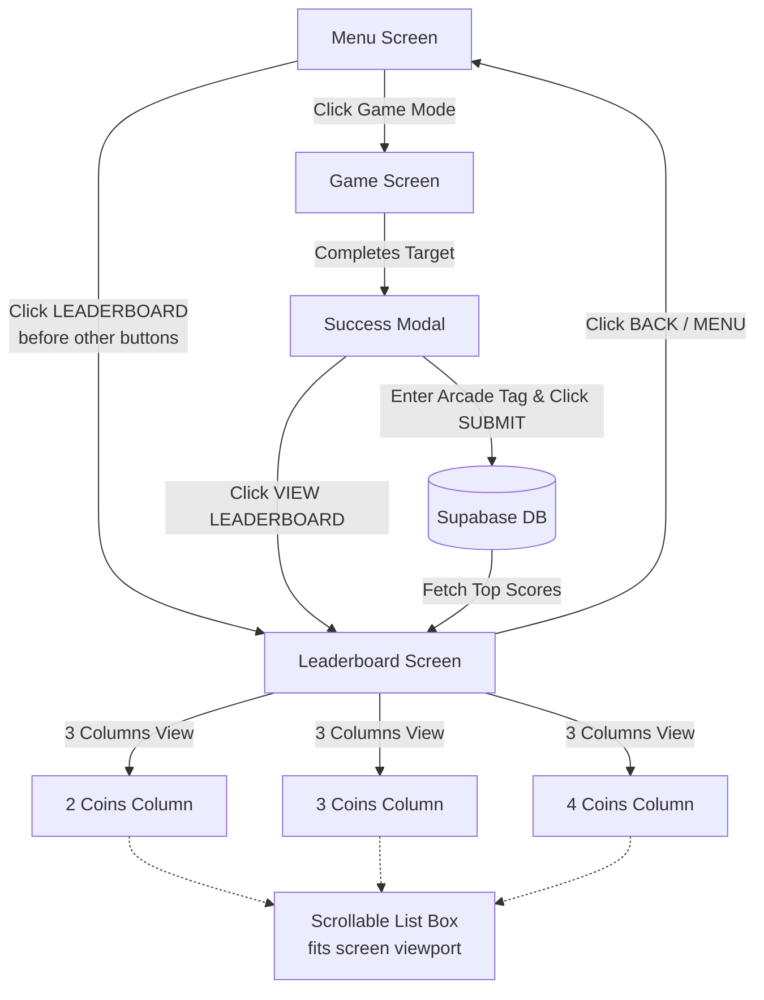

# Implementation Plan: Shared Supabase Leaderboard

Add a global shared leaderboard to **Qubit Rush** powered by Supabase, featuring an arcade-themed CRT interface with 3 game-mode columns (2, 3, and 4 coins), viewport-fitting scrollable rankings, and score submission upon puzzle completion.

---

## User Review Required

> [!IMPORTANT]
> **Vercel & Supabase Environment Security**  
> We must never commit `.env` or sensitive credentials to GitHub.  
> We will add `.env*` (ignoring everything except `.env.example`) to `.gitignore`.  
> Since you have installed the Supabase integration in Vercel, this plan details how Vercel injects the variables, how to bridge them for Vite's client-side build, and how to safely pull them for local development.

> [!NOTE]
> **Leaderboard Button Placement**  
> Per your requirement, the `LEADERBOARD` button will be placed **at the very top of the menu action list** (before `TWO COINS`, `THREE COINS`, `FOUR COINS`, and `HOW TO PLAY`), styled in prominent retro arcade amber (`btn btn--wide btn--amber`).

---

## Step-by-Step Supabase & Vercel Setup Guide

### 1. Database Schema Creation (in Supabase Dashboard)
Open the **SQL Editor** in your Supabase project (from supabase.com), create a new query, and run:

```sql
-- 1. Create the leaderboard table
CREATE TABLE IF NOT EXISTS public.leaderboard (
    id UUID PRIMARY KEY DEFAULT gen_random_uuid(),
    player_name VARCHAR(12) NOT NULL,
    level SMALLINT NOT NULL CHECK (level IN (2, 3, 4)),
    score INTEGER NOT NULL CHECK (score > 0),
    moves INTEGER NOT NULL DEFAULT 0,
    time_seconds INTEGER NOT NULL DEFAULT 0,
    created_at TIMESTAMPTZ NOT NULL DEFAULT now()
);

-- 2. Create index for fast top-score querying per game mode
CREATE INDEX IF NOT EXISTS idx_leaderboard_level_score 
ON public.leaderboard (level, score DESC, created_at ASC);

-- 3. Enable Row Level Security (RLS)
ALTER TABLE public.leaderboard ENABLE ROW LEVEL SECURITY;

-- 4. Policy: Allow anyone (anonymous users) to read scores
CREATE POLICY "Allow public read access"
ON public.leaderboard
FOR SELECT
USING (true);

-- 5. Policy: Allow players to submit their scores
CREATE POLICY "Allow public insert access"
ON public.leaderboard
FOR INSERT
WITH CHECK (
    length(trim(player_name)) >= 1 
    AND length(trim(player_name)) <= 12
    AND score > 0 
    AND level IN (2, 3, 4)
);
```

---

### 2. Vercel + Supabase Integration Setup & Secret Protection

Because the Supabase integration is installed in your Vercel project, Vercel automatically connects your deployment pipeline to Supabase. Here is how to configure it correctly:

#### A. Understand Environment Variable Injection
When Vercel links to Supabase via the official integration:
- Vercel automatically populates environment variables such as `SUPABASE_URL` and `SUPABASE_ANON_KEY` in your Vercel Project (**Settings -> Environment Variables**).
- **Vite Client-side Requirement**: Vite static bundles (`vite build`) only expose variables that start with `VITE_` (e.g. `import.meta.env.VITE_SUPABASE_URL`) to client-side code by default.
- **Solution in Code**: We will update `vite.config.ts` so that during `npm run build` on Vercel, Vite automatically bridges both:
  ```ts
  process.env.VITE_SUPABASE_URL || process.env.SUPABASE_URL
  process.env.VITE_SUPABASE_ANON_KEY || process.env.SUPABASE_ANON_KEY
  ```
  This ensures that whether Vercel names them `SUPABASE_URL` or `VITE_SUPABASE_URL`, the production build embeds the correct public values into the client bundle without failing.

#### B. Verify in Vercel Dashboard
1. Go to your project on [vercel.com](https://vercel.com).
2. Navigate to **Settings** -> **Environment Variables**.
3. Confirm that the Supabase integration has added `SUPABASE_URL` and `SUPABASE_ANON_KEY` across **Production**, **Preview**, and **Development**.
4. **No manual duplicate variables needed**: Because our `vite.config.ts` bridging code checks `process.env.SUPABASE_URL` and `process.env.SUPABASE_ANON_KEY` as fallbacks, you do not need to create extra `VITE_` copies in the Vercel dashboard. The integration's existing variables will work automatically.

#### C. Local Development Workflow (Using Vercel CLI)
To develop and run locally without exposing secrets to git:
1. Ensure `.gitignore` ignores all local `.env` files:
   ```gitignore
   .env
   .env.local
   .env.*.local
   !.env.example
   ```
2. Pull your Vercel project's environment variables straight to your machine:
   ```bash
   npx vercel link                 # Link this directory to your Vercel project
   npx vercel env pull .env.local  # Download secrets directly into local .env.local
   ```
3. Vite automatically loads `.env.local` on startup (`npm run dev`), and git will completely ignore it so your keys stay private.

---

## Architecture & User Flow



---

## Proposed Changes

### 1. Build, Dependencies & Git Security

#### [MODIFY] [.gitignore](file:///home/shanwis/Data/PROJECTS/quantumrush/.gitignore)
- Ensure no secret files can ever be committed to the repo:
  ```gitignore
  .env
  .env.local
  .env.*.local
  !.env.example
  ```

#### [MODIFY] [vite.config.ts](file:///home/shanwis/Data/PROJECTS/quantumrush/vite.config.ts)
- Bridge Vercel integration variables (`SUPABASE_URL`, `SUPABASE_ANON_KEY`) with Vite's client env:
  ```typescript
  import { defineConfig, loadEnv } from 'vite';
  import react from '@vitejs/plugin-react';
  import tailwindcss from '@tailwindcss/vite';

  export default defineConfig(({ mode }) => {
    const env = loadEnv(mode, process.cwd(), '');
    const supabaseUrl = env.VITE_SUPABASE_URL || env.SUPABASE_URL || process.env.SUPABASE_URL || '';
    const supabaseAnonKey = env.VITE_SUPABASE_ANON_KEY || env.SUPABASE_ANON_KEY || process.env.SUPABASE_ANON_KEY || '';

    return {
      plugins: [react(), tailwindcss()],
      define: {
        'import.meta.env.VITE_SUPABASE_URL': JSON.stringify(supabaseUrl),
        'import.meta.env.VITE_SUPABASE_ANON_KEY': JSON.stringify(supabaseAnonKey),
      },
      test: {
        environment: 'node',
        include: ['src/**/*.test.ts'],
      },
    };
  });
  ```

#### [MODIFY] [package.json](file:///home/shanwis/Data/PROJECTS/quantumrush/package.json)
- Add `@supabase/supabase-js` as a dependency.

#### [NEW] [.env.example](file:///home/shanwis/Data/PROJECTS/quantumrush/.env.example)
- Safe template for contributors:
  ```env
  VITE_SUPABASE_URL=https://your-project.supabase.co
  VITE_SUPABASE_ANON_KEY=your-anon-public-key
  ```

---

### 2. Supabase Integration Layer

#### [NEW] [src/lib/supabase.ts](file:///home/shanwis/Data/PROJECTS/quantumrush/src/lib/supabase.ts)
- Initialize Supabase client safely with Vite's environment.
- Export `isSupabaseConfigured: boolean` to determine live vs offline mode.

#### [NEW] [src/game/leaderboard.ts](file:///home/shanwis/Data/PROJECTS/quantumrush/src/game/leaderboard.ts)
- Types: `LeaderboardEntry`, `LeaderboardByLevel`.
- Store and retrieve the player's arcade tag locally (`localStorage`).
- Functions:
  - `fetchLeaderboard(limitPerLevel = 50): Promise<LeaderboardByLevel>`
    - Queries `leaderboard` table filtered by `level IN (2, 3, 4)`, ordered by `score DESC, created_at ASC`.
    - If unconfigured or offline, returns built-in retro arcade high scores and local records gracefully.
  - `submitScore(playerName: string, level: QubitCount, score: number, moves: number, timeSeconds: number)`
    - Sanitizes player initials (1–12 chars, uppercase/alphanumeric arcade style).
    - Inserts score into Supabase.

---

### 3. UI Components & Screens

#### [MODIFY] [src/ui/MenuScreen.tsx](file:///home/shanwis/Data/PROJECTS/quantumrush/src/ui/MenuScreen.tsx)
- Place the **`LEADERBOARD`** button **before all other buttons** in the menu button stack.
- Play retro click sound `sfx("click")` upon clicking.
- Forward `onLeaderboard: () => void` callback to `App.tsx`.

```tsx
<div className="flex w-full max-w-md flex-col items-stretch gap-4">
  <button
    className="btn btn--wide btn--amber"
    onClick={() => {
      onLeaderboard();
      sfx("click");
    }}
  >
    LEADERBOARD
  </button>

  {PLAY_LEVELS.map((level) => (
    <button
      key={level}
      className="btn btn--wide"
      onClick={() => {
        onPlay(level);
        sfx("click");
      }}
    >
      {LEVEL_LABELS[level]}
    </button>
  ))}
  ...
```

#### [NEW] [src/ui/LeaderboardScreen.tsx](file:///home/shanwis/Data/PROJECTS/quantumrush/src/ui/LeaderboardScreen.tsx)
- Full-screen leaderboard page following the exact CRT phosphor/amber retro aesthetic.
- **Screen Fit & Scrolling Guarantee**:
  - The main container is constrained to the screen (`max-h-[calc(100vh-140px)]` or bounded CRT frame).
  - Contains **3 columns** side by side: **TWO COINS**, **THREE COINS**, **FOUR COINS**.
  - Inside each column panel, the list of entries has `overflow-y-auto` with custom retro scrollbar styling.
  - On narrow screens (mobile viewports), includes responsive column toggles/tabs so columns remain readable.
- Each entry displays:
  - **Rank** (`#1`, `#2`, `#3` highlighted in gold/amber/cyan).
  - **Player Name** (e.g. `ACE`, `QBIT`, `QUANTUM`).
  - **Score** (with glowing phosphor text).
  - **Stats** (moves & time on hover/detail).
- Header with CRT status indicator, "REFRESH" button, and "BACK TO MENU" button.
- Clear status banner if running in offline mode.

#### [MODIFY] [src/ui/components/SuccessModal.tsx](file:///home/shanwis/Data/PROJECTS/quantumrush/src/ui/components/SuccessModal.tsx)
- After winning, allow the player to enter their arcade tag (e.g. `ACE`, defaulting to their last used tag) and click **"SUBMIT SCORE"**.
- Provide feedback (`"SCORE TRANSMITTED!"`) and a button to jump straight to the **LEADERBOARD**.

#### [MODIFY] [src/ui/App.tsx](file:///home/shanwis/Data/PROJECTS/quantumrush/src/ui/App.tsx)
- Add screen state management for navigation between Menu, Game, Tutorial, and Leaderboard.
- Provide seamless back navigation with retro click audio.

#### [MODIFY] [src/ui/styles/crt.css](file:///home/shanwis/Data/PROJECTS/quantumrush/src/ui/styles/crt.css)
- Add styling for the leaderboard:
  - `.leaderboard-box`: constrained container fitting the viewport.
  - `.leaderboard-columns`: 3-column responsive grid.
  - `.leaderboard-scroll`: scroll area with custom retro phosphor/amber CRT scrollbars (`scrollbar-color`, `scrollbar-width: thin`).
  - `.leaderboard-rank--top1`, `.leaderboard-rank--top2`, `.leaderboard-rank--top3` badge colors.

---

## Verification Plan

### Automated Tests
1. **Unit Tests** (`npm test`):
   - `src/game/leaderboard.test.ts`:
     - Test score submission formatting and name sanitization.
     - Test fallback mock data when Supabase is offline/unconfigured.
     - Test top-score ordering logic.
2. **E2E Tests** (`npm run test:e2e`):
   - `e2e/menu.spec.ts`: Verify `LEADERBOARD` button exists before `TWO COINS`, `THREE COINS`, and `FOUR COINS`.
   - `e2e/leaderboard.spec.ts`:
     - Navigate to Leaderboard from Menu.
     - Verify 3 columns (2 Coins, 3 Coins, 4 Coins) render.
     - Verify leaderboard container fits within the viewport.
     - Verify scroll container is active and scrollable.
     - Return to Menu via Back button.

### Manual Verification
1. **Menu Placement**: Check that `LEADERBOARD` button is the first button in the menu list.
2. **Layout & 3 Columns**: Open leaderboard, verify 3 distinct columns for 2, 3, and 4 coins.
3. **Screen Fitting & Scrolling**:
   - Resize window to various sizes (desktop, tablet, mobile).
   - Ensure the leaderboard box stays entirely inside the screen frame.
   - Populate or mock 20+ entries and verify scrolling inside the column boxes.
4. **Supabase & Vercel Integration Verification**:
   - Test build with `npm run build` to verify Vite resolves environment variables properly.
   - Play a 2-coin game, win, submit score with name `TEST`, and verify it appears on the leaderboard.
   - Verify unconfigured state displays a graceful banner without any app crash.
